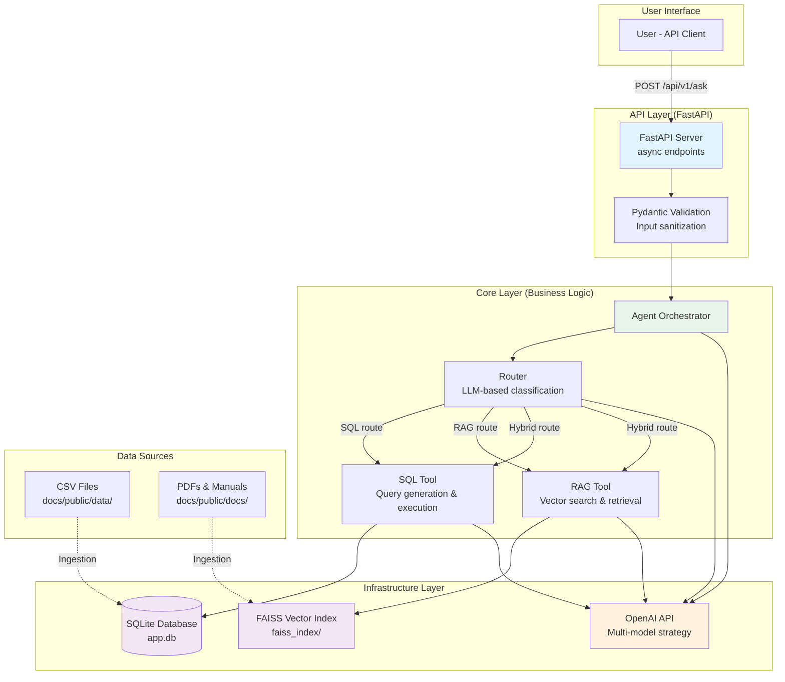
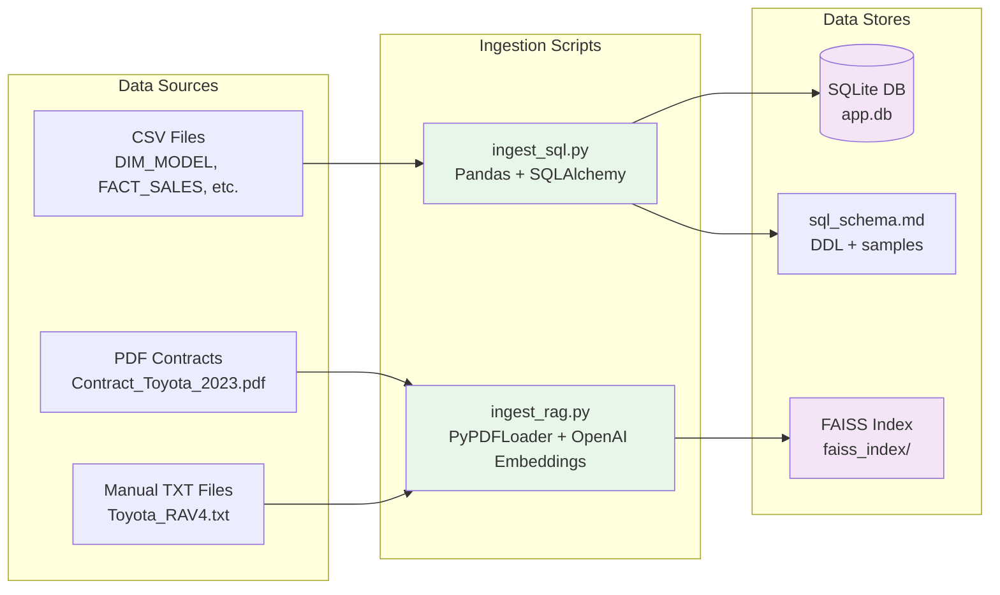

# Agentic Assistant POC


An intelligent agent that answers natural-language questions by intelligently routing between SQL analytics, document retrieval (RAG), or both. This POC demonstrates rapid prototyping discipline with reusable ingestion scripts, configurable multi-model routing, transparent responses, and production-ready documentation.

## Project Structure

This is a **monorepo** containing two projects:

- **`backend/`** - FastAPI backend (Python)
  - See [backend/README.md](backend/README.md) for backend-specific documentation
- **`frontend/`** - React frontend (Vite)
  - See [frontend/README.md](frontend/README.md) for frontend-specific documentation

## Quick Start

### Backend Setup

```bash
cd backend
python -m venv .venv
source .venv/bin/activate  # Windows: .\.venv\Scripts\Activate.ps1
pip install -r requirements.txt
cp .env.example .env
# Edit .env and set OPENAI_API_KEY=sk-your-key-here
python -m scripts.ingest_sql
python -m scripts.ingest_rag
uvicorn src.app.main:app --host 0.0.0.0 --port 8000 --reload
```

### Frontend Setup

```bash
cd frontend
npm install
npm run dev
```

The frontend will run on `http://localhost:5173` and connect to the backend on `http://localhost:8000`.

**Note:** All required data files (CSV datasets and PDF documents) are included in `backend/docs/public/`. No additional downloads needed.

For detailed setup instructions, see:
- [Backend README](backend/README.md)
- [Frontend README](frontend/README.md)

---

## 1. Problem Framing & Solution Overview

### Assignment Requirements

| Requirement from brief | Delivered capability | Technical approach |
| --- | --- | --- |
| SQL over provided CSVs | `scripts/ingest_sql.py` loads five datasets into SQLite; the agent generates grounded SQL with schema context. | **Offline ingestion:** CSV → SQLite with schema generation. **Online query:** LLM generates SQL using `data/db/sql_schema.md` as context. |
| RAG over contracts & manuals | `scripts/ingest_rag.py` creates a FAISS index over contracts, warranty appendix, and curated manual excerpts. | **Distinct chunking:** PDFs as single chunks; TXT manuals split by `====== PAGE` markers. **Embeddings:** OpenAI `text-embedding-3-small` via LangChain. |
| Hybrid reasoning | `src/app/core/agent.py` routes with a cost-aware SLM, splits hybrid questions with a dedicated LLM, and merges SQL + RAG evidence. | **Three-stage pipeline:** (1) Router classifies intent, (2) Split LLM decomposes hybrid questions, (3) Synthesis LLM combines results. |
| Transparent answers | `/api/v1/ask` returns `answer`, `sql_query`, `citations`, `tool_trace` for auditing and debugging. | **Structured response:** Pydantic schemas enforce transparency. `tool_trace` logs router decisions, tool invocations, and intermediate steps. |

### Architectural Approach: Modular Monolith

**Pragmatic Justification (The "Why"):**

This POC follows a **Modular Monolith** architecture with **Clean Architecture principles**, organized into three distinct layers:

1. **`src/app/api` (🔵 Layer 1 - API):** Knows about FastAPI, Pydantic schemas, and HTTP. Handles request/response validation and routing. Calls `core` layer.
2. **`src/app/core` (🟢 Layer 2 - Business Logic):** The "brain" of the application. Knows about the Agent, Tools, and routing logic. Does NOT know about FastAPI or HTTP.
3. **`src/app/infrastructure` (🔴 Layer 3 - External Services):** Knows how to talk to the "outside world" (LLM APIs, SQLite, FAISS). Implements the "how" for the `core` layer.

**Why this approach?**
- **Development velocity:** For a POC, this avoids microservices overhead while enforcing strong internal boundaries.
- **Maintainability:** Clean Architecture ensures core logic is decoupled from infrastructure, making it easy to swap LLM providers, databases, or vector stores.
- **Testability:** Each layer can be tested independently with mocks/stubs.
- **Future-proofing:** To migrate from SQLite → Postgres or FAISS → Azure AI Search, we only change the `infrastructure` layer. The `core` agent logic remains unchanged.

---

## 2. System Architecture & Data Flows

### 2.1. Architecture Diagram



### 2.2. Offline Data Ingestion Flow

**Design Constraint:** The system must operate on pre-ingested data. Users query local data stores, not external APIs, ensuring sub-second response times.

This flow runs **asynchronously** (via manual script execution) to populate our dual data stores:

1. **SQL Ingestion (`scripts/ingest_sql.py`):**
   - **Input:** Five CSV files from `docs/public/data/` (dimension and fact tables).
   - **Process:** 
     - Uses `pandas` to read CSVs and `SQLAlchemy` to create tables.
     - Generates `data/db/sql_schema.md` with DDL, sample rows, and table comments (from `settings.table_comments`).
   - **Output:** SQLite database at `data/db/app.db` + schema artifact for LLM context.
   - **Reset capability:** `reset_database()` safely removes the DB file (handles locked files by dropping tables individually).

2. **RAG Ingestion (`scripts/ingest_rag.py`):**
   - **Input:** PDF contracts and TXT manuals from `docs/public/docs/`.
   - **Process:**
     - **PDFs:** Loaded as single chunks (contracts are self-contained documents).
     - **TXT manuals:** Split by `====== PAGE` markers (preserves page-level context for citations).
     - Uses `OpenAIEmbeddings` to generate vector embeddings.
     - Stores in FAISS index with metadata (source path, page numbers).
   - **Output:** FAISS index at `data/vdb/faiss_index/`.
   - **Reset capability:** `reset_vector_store()` removes the index directory.

**Why dual stores?**
- **SQLite:** Optimized for structured, aggregate queries (COUNT, GROUP BY, JOINs). Indexed for millisecond responses.
- **FAISS:** Optimized for semantic similarity search. Can't efficiently handle both structured and unstructured queries in a single store.

**Offline Ingestion Flow Diagram:**



### 2.3. Online Query Flow (Real-time)

This flow describes what happens from the moment a user sends a question to `/api/v1/ask`. **All operations use async/await patterns for optimal performance and concurrency:**

1. **Input:** FastAPI receives `POST /api/v1/ask` with `{"question": "..."}` via an **async endpoint handler** (`async def ask_question()`).
2. **Validation:** Pydantic `AskRequest` validates the input with strict constraints (non-empty string, max length, character restrictions, SQL injection prevention).
3. **Route to Core:** `src/app/api/router.py` calls `await run_agent(question)` from `src/app/core/agent.py` (all agent functions are `async def`).
4. **Router Decision (`_decide_route`):**
   - **Heuristic hints:** Checks for `settings.sql_keywords` (e.g., "sales", "revenue", "month") and `settings.doc_keywords` (e.g., "manual", "warranty").
   - **LLM classification:** Uses `router_llm` (default: `gpt-4o-mini`, temperature=0.0) with `settings.route_system_prompt` to classify intent via **async LLM call** (`await router_llm.ainvoke(...)`):
     - `SQL`: Structured analytics query
     - `RAG`: Document/policy lookup
     - `BOTH`: Hybrid question requiring both
     - `NONE`: Insufficient context → returns `settings.insufficient_context_message`
   - **Fallback:** If LLM returns invalid response, falls back to heuristics. If still ambiguous, returns `None` (triggers clarification message).
5. **Tool Execution (Fully Async):**
   - **If `SQL`:** 
     - `await _run_sql_pipeline()`:
       - Reads `data/db/sql_schema.md` for schema context (async file I/O via `asyncio.to_thread()` since file operations are synchronous).
       - Uses `sql_llm` (default: `gpt-4o-mini`) with `settings.sql_generation_system_prompt` and `settings.sql_generation_user_prompt` to generate SQL (**async LLM call** via `await sql_llm.ainvoke(...)`).
       - Validates SQL query against security whitelist (blocks DML/DDL operations).
       - Executes query via **async database operations** (`await asyncio.to_thread(db.run, query)`) - SQLite is synchronous, so it's wrapped in a thread pool to prevent blocking the event loop.
       - Synthesizes answer using `synthesis_llm` (default: `gpt-4o`, temperature=0.2) with `settings.sql_system_prompt` (**async LLM call** via `await synthesis_llm.ainvoke(...)`).
   - **If `RAG`:**
     - `await _run_rag_pipeline()`:
       - Loads FAISS index via `load_vector_store()` (synchronous operation wrapped with `asyncio.to_thread()`).
       - Performs `similarity_search(question, k=settings.rag_top_k)` (default: 4 documents) via **async vector search** (`await asyncio.to_thread(store.similarity_search, ...)`) - FAISS is synchronous, so it's wrapped in a thread pool.
       - Formats retrieved docs with source/page metadata.
       - Synthesizes answer using `synthesis_llm` with `settings.rag_system_prompt` (**async LLM call** via `await synthesis_llm.ainvoke(...)`).
   - **If `BOTH` (Hybrid):**
     - `await _run_hybrid_pipeline()`:
       - Uses `split_llm` (default: `gpt-4o`, temperature=0.0) with `settings.hybrid_split_system_prompt` to decompose question into:
         - `sql_question`: Structured analytics portion
         - `rag_question`: Document lookup portion
       - Executes `await asyncio.gather(_run_sql_pipeline(sql_question), _run_rag_pipeline(rag_question))` in parallel (async concurrency).
       - Combines SQL results + RAG citations.
       - Synthesizes unified answer using `synthesis_llm` with `settings.hybrid_system_prompt` (async LLM call).
6. **Response Assembly:**
   - Maps agent output to `AskResponse` schema:
     - `answer`: Natural language response
     - `sql_query`: Generated SQL (if SQL route)
     - `citations`: List of `Citation` objects with `source_document`, `page`, `content` (if RAG route)
     - `tool_trace`: List of strings logging router decision, tool invocations, intermediate steps
7. **Error Handling:** If any step fails, appropriate HTTP status codes are returned:
   - 400 Bad Request for validation errors (with descriptive, non-exposing error messages)
   - 500 Internal Server Error for unexpected internal errors
   - 503 Service Unavailable when external dependencies (OpenAI API) are unavailable
8. **Return:** FastAPI serializes `AskResponse` to JSON and returns to client.

**Key Technical Challenges & Solutions:**

- **Challenge 1: SQL Query Accuracy.** LLMs can hallucinate table names, join keys, or filter values.
  - **Solution:** (1) Provide detailed schema context from `sql_schema.md` in the prompt. (2) Use strict prompt rules (`SQL_GENERATION_USER_PROMPT`) with examples. (3) Use `gpt-4o-mini` with temperature=0.0 for deterministic SQL generation.
- **Challenge 2: Hybrid Question Decomposition.** Splitting "Compare Toyota vs Lexus sales and warranty differences" into SQL and RAG portions is non-trivial.
  - **Solution:** Dedicated `split_llm` (`gpt-4o`) with explicit JSON schema (`{"sql_question": "...", "rag_question": "..."}`) and structured prompt.
- **Challenge 3: Cost Control.** Using `gpt-4o` for every task would be prohibitively expensive.
  - **Solution:** Multi-model strategy (see Section 3.2).
- **Challenge 4: Async Performance.** Synchronous I/O operations block the event loop, limiting concurrency.
  - **Solution:** All API endpoints and I/O-bound operations (LLM calls, database queries, vector searches) use async/await patterns. This enables non-blocking I/O and optimal performance under concurrent load.
- **Challenge 5: SQL Injection Security.** LLM-generated SQL and user input could contain malicious SQL injection attempts.
  - **Solution:** (1) Input validation and sanitization at the API layer using Pydantic schemas. (2) SQL query validation that blocks DML/DDL operations. (3) Read-only database connections with parameterized queries. (4) Whitelist-based query validation before execution.

---

## 3. Technology Choices & Justifications

### 3.1. Backend Stack

**Language: Python 3.10+**
- **Justification:** Industry-standard for AI/ML with unparalleled library support (LangChain, FastAPI, SQLAlchemy, FAISS). Async support for concurrent operations.

**Web Framework: FastAPI**
- **Justification:** 
  - High-performance async framework (comparable to Node.js/Go).
  - Native async/await support for non-blocking I/O operations (critical for production-scale systems).
  - Native Pydantic integration for request/response validation with strict constraints.
  - Automatic OpenAPI (Swagger) documentation.
  - Built-in support for streaming responses (future: SSE for chat UX).

**Orchestration: LangChain**
- **Justification:**
  - Provides abstraction layer for LLM providers (OpenAI, Anthropic, etc.). Enables easy provider switching.
  - Built-in components: `ChatOpenAI`, `SQLDatabase`, `FAISS` wrappers.
  - Tool/Agent patterns for routing logic.
  - **Future-proofing:** If we migrate to LangGraph or a different framework, the core agent logic (`src/app/core/agent.py`) remains isolated.

**Validation: Pydantic v2**
- **Justification:**
  - Type-safe schemas for API contracts (`AskRequest`, `AskResponse`, `Citation`).
  - Settings management via `pydantic-settings` (reads from `.env` with validation).
  - Automatic serialization/deserialization.

### 3.2. Multi-Model Strategy (Cost & Performance Optimization)

**Challenge:** Different tasks require different model capabilities. Using a single expensive model for everything would be cost-prohibitive and slow.

**Solution: Task-Specific Model Selection**

| Model | Use Case | Justification |
| --- | --- | --- |
| `gpt-4o-mini` (Router) | Intent classification | Fast, cheap ($0.15/1M input tokens). Deterministic (temperature=0.0) for consistent routing. |
| `gpt-4o-mini` (SQL Generation) | Text-to-SQL translation | Structured output (SQL) doesn't require creative reasoning. Temperature=0.0 ensures deterministic queries. |
| `gpt-4o` (Hybrid Split) | Question decomposition | Requires nuanced understanding to split hybrid questions. Higher quality model ensures accurate decomposition. |
| `gpt-4o` (Synthesis) | Answer generation | Natural language synthesis requires high-quality reasoning. Temperature=0.2 allows slight variation for natural responses. |

**Cost Impact:**
- **Example query:** "Monthly RAV4 HEV sales in Germany in 2024"
  - Router: `gpt-4o-mini` (~100 tokens) = $0.000015
  - SQL generation: `gpt-4o-mini` (~500 tokens) = $0.000075
  - Synthesis: `gpt-4o` (~200 tokens) = $0.0006
  - **Total: ~$0.0007 per query**
- **If using `gpt-4o` for all steps:** ~$0.002 per query (3x more expensive).

**Configuration:** All models and temperatures are configurable via `.env` (see `src/app/config.py`), enabling A/B testing and cost optimization.

### 3.3. Data Infrastructure

**Structured Store: SQLite**
- **Justification (POC):**
  - **Zero-configuration:** File-based database that requires no server setup or connection configuration. Perfect for local development and demos.
  - **Easy to use locally:** No need to install, configure, or connect to a separate database server. Simply works out of the box.
  - **Ideal for POC:** With small datasets, SQLite provides excellent performance without the overhead of managing a database server.
  - **SQLAlchemy abstraction:** Provides abstraction layer. Migration to Postgres/Snowflake requires only changing the connection string.
  - **Production path:** Migrate to managed Postgres (Azure Database for PostgreSQL) for concurrency and scale.

**Vector Store: FAISS (CPU)**
- **Justification (POC):**
  - **Local and lightweight:** File-based vector index with no external dependencies. No need for a separate vector database service.
  - **Perfect for small datasets:** With a small number of documents (contracts, manuals), FAISS provides efficient similarity search without infrastructure overhead.
  - **Ideal for POC:** The amount of data is small, making FAISS the correct choice for a proof-of-concept that needs to run locally.
  - **LangChain wrappers:** Provides consistent API. Migration to Azure AI Search/Pinecone requires only changing the `load_vector_store()` implementation.
  - **Production path:** Migrate to managed vector store (Azure AI Search) for scale, security, and hybrid search capabilities.

**Why not a single database?**
- **SQLite/Postgres:** Optimized for structured queries (JOINs, aggregations, indexes). Cannot efficiently perform semantic similarity search.
- **FAISS/Azure AI Search:** Optimized for vector similarity search. Cannot efficiently handle complex SQL queries.
- **Dual-store architecture:** Each store is optimized for its use case. The agent orchestrates both as needed.

### 3.4. Configuration Management

**Centralized Settings: `src/app/config.py`**

All configurable parameters are centralized using `pydantic-settings`:

- **Paths:** Database locations, document directories, vector store paths.
- **LLM Models & Temperatures:** Router, SQL, Split, Synthesis models.
- **RAG Tuning:** `rag_top_k` (number of documents to retrieve).
- **Routing Heuristics:** `sql_keywords`, `doc_keywords` for hint generation.
- **Prompts:** All system and user prompts (router, SQL generation, RAG synthesis, hybrid split/synthesis).
- **Table Comments:** Metadata for SQL schema generation.
- **Security Settings:** `question_max_length`, `dangerous_sql_keywords`.

**Environment-Agnostic Design:**

The configuration system is designed to work seamlessly across different deployment environments:

**Configuration Precedence (highest to lowest):**
1. **Environment Variables** (system/env) - Used in cloud/production
2. **`.env` file** (if exists) - Used in local development
3. **Default values** (`default_factory`) - Fallback defaults

**Why this approach?**
- **Local Development:** Use `.env` file for convenience. Git-ignored for security.
- **Cloud Deployment:** Set environment variables or secrets (Azure Key Vault, AWS Secrets Manager, Kubernetes secrets, etc.). The `.env` file is automatically ignored.
- **Same Code, Different Environments:** No code changes needed when moving from local to cloud.

**Example Cloud Deployment (Azure Container Apps):**
```bash
# Set environment variables directly
az containerapp update \
  --name agentic-poc \
  --resource-group my-rg \
  --set-env-vars \
    OPENAI_API_KEY=$OPENAI_KEY \
    QUESTION_MAX_LENGTH=2000 \
    ROUTER_LLM_MODEL=gpt-4o-mini

# Or use Azure Key Vault for secrets (recommended)
az containerapp update \
  --name agentic-poc \
  --resource-group my-rg \
  --secrets \
    openai-key=keyvaultref:https://my-vault.vault.azure.net/secrets/openai-api-key \
  --env-vars \
    OPENAI_API_KEY=secretref:openai-key \
    QUESTION_MAX_LENGTH=2000
```

> **📚 Detailed Azure Configuration Guide:** See `docs/public/config/azure-deployment.md` for comprehensive examples including Azure App Service, AKS, Key Vault integration, and Azure DevOps pipelines.

**Why `.env` + `config.py`?**
- **`.env`:** Stores secrets (API keys) and environment-specific overrides. Git-ignored for security.
- **`config.py`:** Provides defaults and validation. Ensures type safety and prevents runtime errors.
- **Environment Variables:** Override both `.env` and defaults. Enables per-environment configuration (dev/staging/prod) without code changes.

---

## 4. Data Assets

### 4.1. Structured Data (SQLite)

| Table | Key columns | Purpose | Design rationale |
| --- | --- | --- | --- |
| `DIM_COUNTRY` | `country`, `country_code`, `region` | Geo metadata for joins and region filters. | Dimension table for star schema. Enables efficient region-based aggregations. |
| `DIM_MODEL` | `model_id`, `model_name`, `brand`, `segment`, `powertrain` | Vehicle catalogue bridging to facts. | Dimension table. Supports filtering by brand/model/powertrain without denormalizing fact table. |
| `DIM_ORDERTYPE` | `ordertype_id`, `ordertype_name`, `description` | Sales channel semantics. | Dimension table for order type analysis (B2C vs B2B). |
| `FACT_SALES` | `model_id`, `country_code`, `year`, `month`, `contracts` | Monthly sales volumes. | Core fact table. Grain: model × country × year × month. |
| `FACT_SALES_ORDERTYPE` | `model_id`, `country_code`, `year`, `month`, `ordertype_id`, `contracts` | Sales by channel. | Extended fact table for order type analysis. |

**Schema Artifact:** `scripts/ingest_sql.py` generates `data/db/sql_schema.md` containing:
- `CREATE TABLE` statements (DDL)
- Sample rows (first 3 rows per table)
- Table comments (from `settings.table_comments`) explaining purpose and relationships

This artifact is injected into the SQL generation prompt, providing the LLM with accurate schema context and reducing hallucination.

### 4.2. Unstructured Data (FAISS Index)

| File | Location | Coverage | Chunking strategy |
| --- | --- | --- | --- |
| `Contract_Toyota_2023.pdf` | `docs/public/docs/` | Toyota fleet contract clauses, warranty obligations. | Single chunk (entire PDF). Contracts are self-contained documents. |
| `Contract_Lexus_2023.pdf` | `docs/public/docs/` | Lexus contract counterpart. | Single chunk. |
| `Warranty_Policy_Appendix.pdf` | `docs/public/docs/` | Regional warranty rules and escalation paths. | Single chunk. |
| `Toyota_RAV4.txt` | `docs/public/docs/manuals/` | Safety section: SRS airbags, child restraints, seat belts. | Split by `====== PAGE` markers. Preserves page-level context for citations. |
| `Toyota_YARIS_GRMN.txt` | `docs/public/docs/manuals/` | Keys, smart entry, alarms, battery recovery. | Split by `====== PAGE` markers. |

**Information Coverage:**
- **Toyota RAV4:** SRS airbag component map, deployment rules, child-seat guidance, seat-belt pretensioner maintenance checkpoints.
- **Toyota Yaris GRMN:** Smart entry key types, antenna coverage diagrams, alarm troubleshooting, electronic key battery recovery/customisation notes.

**Why distinct chunking strategies?**
- **PDFs (contracts):** Legal documents are best understood as complete units. Splitting could lose context (e.g., warranty terms spanning multiple pages).
- **TXT manuals:** Technical manuals have page-level structure. Splitting by `====== PAGE` preserves citation accuracy (users can reference "page 4") while maintaining semantic coherence.

---

## 5. Setup & Environment

### 5.1. Prerequisites

- **Python 3.10+** (tested on 3.11)
  - Verify: `python --version` or `python3 --version`
- **OpenAI API key** (for LLM and embeddings)
  - Get one at: https://platform.openai.com/api-keys
- **Data files** (included in repo)
  - CSV files: `docs/public/data/` (5 files: DIM_COUNTRY, DIM_MODEL, DIM_ORDERTYPE, FACT_SALES, FACT_SALES_ORDERTYPE)
  - PDF documents: `docs/public/docs/` (contracts and warranty policy)
  - Manuals: `docs/public/docs/manuals/` (Toyota RAV4 and Yaris GRMN)

### 5.2. Installation Steps

| Step | Windows (PowerShell) | macOS / Linux (bash/zsh) |
| --- | --- | --- |
| Clone repo | `git clone <repo-url>`<br>`cd agentic_poc` | same |
| Python venv | `python -m venv .venv` | `python3 -m venv .venv` |
| Activate venv | `.\.venv\Scripts\Activate.ps1` | `source .venv/bin/activate` |
| Install deps | `pip install -r requirements.txt` | `pip install -r requirements.txt` |
| Configure OpenAI key | `Copy-Item .env.example .env`<br>Edit `.env` and set `OPENAI_API_KEY=sk-your-key-here` | `cp .env.example .env`<br>Edit `.env` and set `OPENAI_API_KEY=sk-your-key-here` |

> **Important:** `OPENAI_API_KEY` must be set in `.env`. The `.env` file is Git-ignored for security. Docker requires `--env-file .env` at runtime.

### 5.3. Data Ingestion (Run After Setup)

**Note:** All data files are included in the repository. No downloads required.

| Task | Windows (PowerShell) | macOS / Linux (bash/zsh) |
| --- | --- | --- |
| Build/refresh SQLite | `cd backend`<br>`python -m scripts.ingest_sql` | same |
| Reset DB file | `cd backend`<br>`python -c "from scripts.ingest_sql import reset_database; reset_database()"` | `cd backend`<br>`python -c 'from scripts.ingest_sql import reset_database; reset_database()'` |
| Build/refresh FAISS | `cd backend`<br>`python -m scripts.ingest_rag` | same |
| Reset FAISS index | `cd backend`<br>`python -c "from scripts.ingest_rag import reset_vector_store; reset_vector_store()"` | `cd backend`<br>`python -c 'from scripts.ingest_rag import reset_vector_store; reset_vector_store()'` |

**Expected output:**
- SQL ingestion: Creates `data/db/app.db` and `data/db/sql_schema.md` (~1-2 seconds)
- RAG ingestion: Creates `data/vdb/faiss_index/` (~10-30 seconds, depends on OpenAI API)

**Why reset functions?**
- Enables iterative development: update CSVs/manuals → reset → re-ingest.
- Handles locked files gracefully (SQLite on Windows can be locked by active connections).

---

## 6. Running the API

### Option A – Local Uvicorn

| Action | Windows (PowerShell) | macOS / Linux (bash/zsh) |
| --- | --- | --- |
| Start server | `cd backend`<br>`uvicorn src.app.main:app --host 0.0.0.0 --port 8000 --reload` | same |
| Health check | `Invoke-WebRequest -Uri http://127.0.0.1:8000/health` | `curl http://127.0.0.1:8000/health` |
| Ask question | `$body = @{question="Monthly RAV4 sales in 2024"} \| ConvertTo-Json; Invoke-WebRequest -Uri http://127.0.0.1:8000/api/v1/ask -Method POST -ContentType "application/json" -Body $body` | `curl -X POST http://127.0.0.1:8000/api/v1/ask -H "Content-Type: application/json" -d '{"question": "Monthly RAV4 sales in 2024"}'` |

**Why `--reload`?**
- Enables hot-reload during development. Code changes trigger automatic server restart.

### Option B – Docker

| Action | Windows (PowerShell) | macOS / Linux (bash/zsh) |
| --- | --- | --- |
| Build image | `cd backend`<br>`docker build -t agentic-poc .` | same |
| Run container | `cd backend`<br>`docker run --rm -p 8001:8000 --env-file .env agentic-poc` | same |
| Health check | `Invoke-WebRequest -Uri http://127.0.0.1:8001/health` | `curl http://127.0.0.1:8001/health` |
| Ask question | `$body = @{question="Monthly RAV4 sales in 2024"} \| ConvertTo-Json; Invoke-WebRequest -Uri http://127.0.0.1:8001/api/v1/ask -Method POST -ContentType "application/json" -Body $body` | `curl -X POST http://127.0.0.1:8001/api/v1/ask -H "Content-Type: application/json" -d '{"question": "Monthly RAV4 sales in 2024"}'` |

> **Note:** Change the host port (`-p 8002:8000`) if 8001 is already taken. Docker requires the `.env` file for the API key via `--env-file`.

**Dockerfile Strategy:**
- Multi-stage builds (future optimization).
- Copies only `src/`, `data/`, `docs/public/` (excludes private docs and `.env`).
- Exposes port 8000 for FastAPI.

---

## 7. Frontend Development

### 7.1. Prerequisites

- **Node.js 18+** and npm (for frontend development)
- Backend API running on `http://localhost:8000` (see Section 6)

### 7.2. Local Development

**Setup:**
```bash
cd frontend
npm install
```

**Start development server:**
```bash
npm run dev
```

The frontend will run on `http://localhost:5173` (Vite default port) and automatically proxy API requests to `http://localhost:8000`.

**Note:** Make sure the backend is running on port 8000 before starting the frontend.

**Environment Variables:**
- `VITE_API_URL`: Backend API URL (defaults to `http://localhost:8000` in development)
- Create `frontend/.env.local` to override:
  ```
  VITE_API_URL=http://localhost:8000
  ```

### 7.3. Frontend Features

- **Chat Interface:** Simple, clean chat UI for asking questions
- **Message History:** Displays conversation history with user questions and assistant responses
- **Expandable Details:** 
  - SQL queries (if SQL route was used)
  - Citations (if RAG route was used)
  - Tool trace (for debugging and transparency)
- **Loading States:** Visual feedback during API calls
- **Error Handling:** User-friendly error messages

### 7.4. Build for Production

```bash
cd frontend
npm run build
```

This creates an optimized production build in `frontend/dist/`.

---

## 8. Deployment to Vercel

### 8.1. Prerequisites

- Vercel account (free tier is sufficient)
- GitHub/GitLab/Bitbucket repository (or use Vercel CLI)
- Backend data ingested (SQLite DB and FAISS index)

### 8.2. Deployment Strategy

**Why `vercel.json` is in the root?**

The root `vercel.json` is configured for **Option A** (single Vercel project). It tells Vercel:
- Build backend as Python serverless functions (`api/index.py`)
- Build frontend as static site (`frontend/package.json`)
- Route `/api/*` to backend, `/*` to frontend

**Two Deployment Options:**

#### Option A: Single Vercel Project (Monorepo) - Current Setup ✅

Deploy both backend and frontend as a single Vercel project:

1. **Connect Repository:**
   - Go to [vercel.com](https://vercel.com)
   - Click "New Project"
   - Import your Git repository

2. **Configure Project:**
   - **Framework Preset:** Other
   - **Root Directory:** `.` (root - uses `vercel.json` and `api/index.py`)
   - **Build Command:** Leave empty (Vercel will detect Python and Node.js)
   - **Output Directory:** Leave empty

3. **Routes (configured in `vercel.json`):**
   - `/api/*` → Backend serverless functions (`api/index.py`)
   - `/*` → Frontend static files (`frontend/dist/`)

**Pros:** Simple setup, single deployment, shared domain  
**Cons:** Less isolation, harder to scale independently

#### Option B: Separate Vercel Projects (Recommended for Production) 🚀

Deploy backend and frontend as separate projects for better isolation:

**Backend Project:**
1. Create new Vercel project
2. **Root Directory:** `.` (root)
3. **Build Command:** Leave empty
4. Uses `api/index.py` for serverless functions
5. **No need for `vercel.json`** - Vercel auto-detects Python

**Frontend Project:**
1. Create new Vercel project  
2. **Root Directory:** `frontend`
3. **Framework Preset:** Vite (auto-detected)
4. **No need for `vercel.json`** - Vercel auto-detects Vite

**Pros:** Better isolation, independent scaling, separate domains  
**Cons:** Two projects to manage, need to configure CORS

**To switch to Option B:** You can delete the root `vercel.json` and deploy as separate projects.

3. **Environment Variables:**
   Add the following in Vercel dashboard → Settings → Environment Variables:
   ```
   OPENAI_API_KEY=sk-your-key-here
   ```
   Optionally add:
   ```
   ADMIN_TOKEN=your-admin-token-here
   ENABLE_RATE_LIMIT=true
   DAILY_INTERACTION_LIMIT=20
   ```

4. **Deploy:**
   - Click "Deploy"
   - Vercel will detect `vercel.json` and `api/index.py`
   - Backend will be available at `https://your-project.vercel.app/api/`

**Option B: Using Vercel CLI**

```bash
# Install Vercel CLI
npm i -g vercel

# Login
vercel login

# Deploy
vercel

# Set environment variables
vercel env add OPENAI_API_KEY
```

### 8.3. Environment Variables

**Backend (in Vercel dashboard or `backend/.env`):**
```
OPENAI_API_KEY=sk-your-key-here
ADMIN_TOKEN=your-admin-token  # Optional
CORS_ORIGINS=https://your-frontend.vercel.app  # For production
```

**Frontend (in Vercel dashboard or `frontend/.env.local`):**
```
VITE_API_URL=https://your-backend.vercel.app
```

**CORS Configuration:**

The backend automatically reads `CORS_ORIGINS` environment variable. Set it in Vercel dashboard:

```
CORS_ORIGINS=https://your-frontend.vercel.app
```

Or add multiple origins (comma-separated):
```
CORS_ORIGINS=https://frontend1.vercel.app,https://frontend2.vercel.app
```

Local development origins (`localhost:5173`, `localhost:3000`) are included by default.

### 8.4. Post-Deployment Checklist

- [ ] Backend health check: `https://your-backend.vercel.app/health`
- [ ] Frontend loads correctly
- [ ] API requests work from frontend (check browser console)
- [ ] CORS configured correctly
- [ ] Environment variables set in Vercel dashboard
- [ ] Data files (`data/db/app.db`, `data/vdb/faiss_index/`) are included in deployment

**Note:** For production, consider:
- Using external storage for SQLite DB and FAISS index (e.g., Vercel Blob Storage, AWS S3)
- Setting up proper CORS origins via environment variables
- Configuring custom domains
- Setting up monitoring and logging

---

## 9. Sample Questions & Expected Behavior

| Question | Expected route | Technical details |
| --- | --- | --- |
| "Monthly RAV4 HEV sales in Germany in 2024." | SQL | Router detects `sql_keywords` ("sales", "month"). LLM generates SQL with `JOIN DIM_MODEL`, filters `brand='Toyota'`, `model_name='RAV4'`, `powertrain='HEV'`, `country_code='DE'`, `year=2024`, `GROUP BY month`. `sql_query` returned in response. |
| "What is the standard Toyota warranty for Europe?" | RAG | Router detects `doc_keywords` ("warranty"). FAISS retrieves relevant chunks from `Contract_Toyota_2023.pdf` and `Warranty_Policy_Appendix.pdf`. Citations include source PDF and page numbers. |
| "Where is the tire repair kit located for the UX?" | RAG | Router routes to RAG. FAISS searches manuals. Current manual set covers analogous safety topics (extendable). Citations reference manual source. |
| "Compare Toyota vs Lexus SUV sales in Western Europe in 2024 and summarize key warranty differences." | Hybrid | Router detects both SQL and RAG intent. Split LLM decomposes: `sql_question="Compare Toyota vs Lexus SUV sales in Western Europe in 2024"`, `rag_question="summarize key warranty differences between Toyota and Lexus"`. Both pipelines execute. Synthesis LLM combines results with citations. |

**Transparency Features:**
- `tool_trace` shows router decision, executed tools, and hybrid synthesis steps.
- `sql_query` enables SQL validation and debugging.
- `citations` enable source verification for RAG answers.

---

## 10. Testing Strategy

### 10.1. Automated Tests

| Scope | Command | What it tests |
| --- | --- | --- |
| **Unit Tests** | `python -m pytest tests/unit/ -vv` | **Agent Logic (`test_agent.py`):** Router logic, SQL/RAG/hybrid branches, insufficient-context fallback, SQL query validation (blocks DML/DDL, allows SELECT), error handling (pipeline exceptions). **Schema Validation (`test_schemas.py`):** Pydantic validation with edge cases (empty strings, whitespace-only, max length boundaries, exceeds max length), SQL injection pattern detection (DROP, DELETE, comments, UNION, OR), special characters handling (legitimate vs malicious), all dangerous keywords from config. |
| **Integration Tests** | `python -m pytest tests/integration/ -vv` | **API Endpoints (`test_api.py`):** FastAPI endpoint contract, response schema validation, **edge cases** (empty questions → 422, whitespace-only → 422, exceeds max length → 422, SQL injection attempts → 422, malformed JSON → 422, missing/null fields → 422), **error scenarios** (LLM API failures → 500/503, database unavailability → 500, vector store unavailability → 500, no stack traces exposed). Uses `httpx.AsyncClient` with `ASGITransport` for proper async testing. |
| **Security Tests** | `python -m pytest tests/security/ -vv` | **SQL Injection Prevention (`test_security.py`):** Multiple SQL injection patterns blocked at API layer (DROP, DELETE, UPDATE, INSERT, ALTER, TRUNCATE, EXEC, UNION, OR), LLM-generated malicious SQL blocked before execution, all dangerous keywords from config tested. **Input Validation:** Max/min length enforcement, special characters validation, required fields enforcement. **Error Information Leakage:** No stack traces, file paths, database schemas, or API keys exposed in error responses. |
| **Ingestion Tests** | `python -m pytest tests/test_ingestion.py -vv` | **SQL Ingestion:** CSV loading, database creation, schema report generation, full pipeline. **RAG Ingestion:** File discovery, document loading, vector store creation, full pipeline. |
| **All Tests** | `python -m pytest tests/ -vv` | Runs all test suites (69 tests total: 28 unit, 13 integration, 14 security, 14 ingestion). |

**Testing Philosophy:**
- **Unit tests:** Mock LLM calls and database/vector store access. Test routing logic, prompt formatting, citation building, SQL query validation. Include **edge cases** (empty strings, whitespace-only, max length boundaries, exceeds max length, special characters) and **error scenarios** (validation failures, exception propagation, SQL validation failures).
- **Integration tests:** Use `httpx.AsyncClient` with `ASGITransport` (not `TestClient`) to properly test async endpoints. Test full request/response cycle with real async behavior. Validate Pydantic schemas. Include **edge cases** (empty questions, exceeds max length, SQL injection attempts, malformed JSON, missing/null fields) and **error scenarios** (LLM API failures → 500/503, database unavailability → 500, vector store unavailability → 500, proper error message formatting without stack traces).
- **Security tests:** Multi-layered security validation:
  - **API Layer:** Input validation with Pydantic (max length, SQL injection pattern detection, dangerous keywords).
  - **Core Layer:** SQL query validation (blocks DML/DDL, enforces SELECT-only).
  - **Infrastructure Layer:** Read-only database connections.
  - **Error Information Protection:** Verify no stack traces, file paths, database schemas, or API keys are exposed in error responses.

**Async Testing:** All tests use `@pytest.mark.asyncio` and `httpx.AsyncClient` to properly handle async endpoints and verify non-blocking I/O behavior.

### 10.2. Manual Testing

Extended manual checks (hybrid splits, FAISS probes, settings inspection) are documented in `docs/private/tests/local_testing.md`. This includes:
- Direct FAISS similarity searches
- SQL schema inspection
- Agent function invocation from Python REPL
- Configuration validation

**Why manual testing?**
- LLM behavior is non-deterministic (even with temperature=0.0, prompts can vary).
- Vector search quality requires human evaluation.
- Prompt engineering requires iterative testing.

---

## 11. Troubleshooting

### Common Issues

| Issue | Solution |
| --- | --- |
| **`ModuleNotFoundError`** when running scripts | Ensure virtual environment is activated: `source .venv/bin/activate` (Windows: `.\.venv\Scripts\Activate.ps1`) |
| **`OPENAI_API_KEY` not found** | Check `.env` file exists and contains `OPENAI_API_KEY=sk-...` (no quotes, no spaces around `=`) |
| **SQLite database locked** (Windows) | Close any DB browser tools (DB Browser, VS Code SQLite extension). Or use reset function: `python -c "from scripts.ingest_sql import reset_database; reset_database()"` |
| **`FileNotFoundError` for CSV/PDF files** | Verify data files exist: `ls docs/public/data/` and `ls docs/public/docs/`. Files are included in the repo. |
| **Port 8000 already in use** | Change port: `uvicorn src.app.main:app --host 0.0.0.0 --port 8001 --reload` |
| **RAG ingestion fails with API error** | Check OpenAI API key is valid and has credits. Check network connectivity. |
| **SQL queries return empty results** | Verify ingestion completed: check `data/db/app.db` exists and `data/db/sql_schema.md` has content. Re-run `python -m scripts.ingest_sql` |

### Verification Steps

After setup, verify everything works:

```bash
# 1. Check Python version
python --version  # Should be 3.10+

# 2. Check dependencies installed
pip list | grep -E "(fastapi|langchain|faiss)"  # Should show installed packages

# 3. Check data files exist
ls backend/docs/public/data/*.csv  # Should show 5 CSV files
ls backend/docs/public/docs/*.pdf  # Should show 3 PDF files

# 4. Check ingestion completed
ls backend/data/db/app.db  # Should exist
ls backend/data/vdb/faiss_index/  # Should contain index.faiss and index.pkl

# 5. Test API health
curl http://127.0.0.1:8000/health  # Should return {"status":"ok"}
```

---

## 12. Technical Debt & Production Path

This POC is designed for **rapid demonstration** and **iterative development**. The following items are documented to guide next-phase investment and stakeholder discussions:

1. **Conversation memory:** Implement short-term memory management within the same conversation session (e.g., LangChain `ConversationBufferMemory` or custom session store) to enable contextual follow-up questions and maintain conversation state across multiple API calls.
2. **Managed persistence:** Migrate SQLite → Postgres/Snowflake; FAISS → managed vector store (Azure AI Search, Pinecone) for scale & concurrency.
3. **Automated manual ingestion:** Replace manual TXT extraction with Playwright/puppeteer crawler or official API; address licensing.
4. **Authentication & Authorization:** Implement user authentication (API keys, OAuth 2.0, JWT tokens) and role-based access control (RBAC). Currently, the API is open to all requests. Rate limiting uses IP-based identification; production requires user-based identification for accurate per-user limits.
5. **Enhanced Error Handling & Retries:** Implement automatic retries with exponential backoff for external API calls (OpenAI), circuit breakers to prevent cascading failures, and dead letter queues for persistent errors. Currently, errors are returned immediately without retry logic.
6. **Monitoring & Alerting:** Add structured logging (JSON format), application performance monitoring (APM) with Datadog/Azure Monitor, metrics collection (latency, throughput, error rates), and automated alerts for critical issues (high error rates, API downtime, performance degradation).
7. **Load Testing:** Conduct comprehensive load testing using tools like Locust or k6 to identify system bottlenecks, determine maximum throughput, and validate performance under stress. Currently, no load testing has been performed.
8. **Security Audit:** Conduct professional security audit including code review, dependency scanning (Snyk, Dependabot), penetration testing, and OWASP Top 10 analysis. While basic security measures are implemented, a comprehensive audit is required for production.
9. **Secrets & security:** Move `.env` into a vault (Azure Key Vault), enforce least-privilege DB roles.
10. **CI/CD:** GitHub Actions or Azure DevOps pipeline running lint/tests/docker build on push.
11. **LangGraph migration:** Upgrade planner to LangGraph for explicit state management, retries, and better guardrails.
12. **Stakeholder interface:** Wrap the API with a lightweight UI (Streamlit/Gradio) for demos and workshops.
13. **Streaming responses:** Implement Server-Sent Events (SSE) for real-time answer streaming (improves perceived latency).
14. **Caching:** Add Redis cache for identical queries to reduce LLM costs and latency.

**Production Readiness Checklist:**
- [x] Async/await patterns for all I/O-bound operations
- [x] Comprehensive input validation and sanitization
- [x] SQL injection prevention (query validation, read-only connections, parameterized queries)
- [x] Robust error handling with appropriate HTTP status codes
- [x] Testing coverage for edge cases and error scenarios
- [x] Security tests for injection attacks and information leakage
- [x] Rate limiting (daily interaction limits per IP, configurable via `ENABLE_RATE_LIMIT` and `DAILY_INTERACTION_LIMIT`)
- [ ] Authentication/authorization
- [ ] Error handling & retries (enhanced)
- [ ] Monitoring & alerting
- [ ] Load testing
- [ ] Security audit

---

## 13. Author & Contact

**Cristopher Rojas Lepe** — AI & Data Engineer
- LinkedIn: https://www.linkedin.com/in/cristopherrojaslepe/
- Email: cristopher.rojas.lepe@gmail.com

Feel free to reach out for walkthroughs or to dive into any architectural or prompt-engineering detail. Every decision traces back to the PRD/TDD/backlog for quick context.

---

## Appendix: Key Design Decisions

### A.1. Why LangChain Instead of Direct OpenAI SDK?

**Decision:** Use LangChain as an abstraction layer for LLM orchestration.

**Rationale:**
- **Provider agnosticism:** LangChain supports OpenAI, Anthropic, Azure OpenAI, etc. Switching providers requires only changing the model wrapper, not the agent logic.
- **Tool patterns:** Built-in support for agents, tools, and chains simplifies routing logic.
- **Future-proofing:** If we migrate to LangGraph or a different framework, the core agent logic remains isolated in `src/app/core/agent.py`.

**Trade-off:** Slight performance overhead vs. direct SDK calls. Acceptable for POC; can optimize in production.

### A.2. Why Heuristic + LLM Routing Instead of Pure LLM?

**Decision:** Combine keyword heuristics with LLM classification for routing.

**Rationale:**
- **Cost:** Heuristics are free. LLM call costs ~$0.000015 per query. Using heuristics as hints reduces LLM token count.
- **Reliability:** Heuristics provide fallback if LLM returns invalid response.
- **Speed:** Heuristic checks are instant. LLM calls add ~100-200ms latency.

**Trade-off:** Heuristics can be brittle (e.g., "sales manual" might trigger SQL keywords). LLM classification handles edge cases.

### A.3. Why Separate Split LLM for Hybrid Questions?

**Decision:** Use dedicated `gpt-4o` model for hybrid question decomposition.

**Rationale:**
- **Complexity:** Splitting "Compare Toyota vs Lexus sales and warranty differences" requires nuanced understanding of which parts are SQL vs. RAG.
- **Quality:** `gpt-4o-mini` can misclassify hybrid questions. `gpt-4o` ensures accurate decomposition.
- **Cost:** Split LLM is called once per hybrid query. Synthesis LLM is called regardless. Net cost increase is minimal (~$0.0002 per hybrid query).

**Trade-off:** Slightly higher cost vs. improved accuracy. Worth it for hybrid queries (typically <10% of total queries).

---


